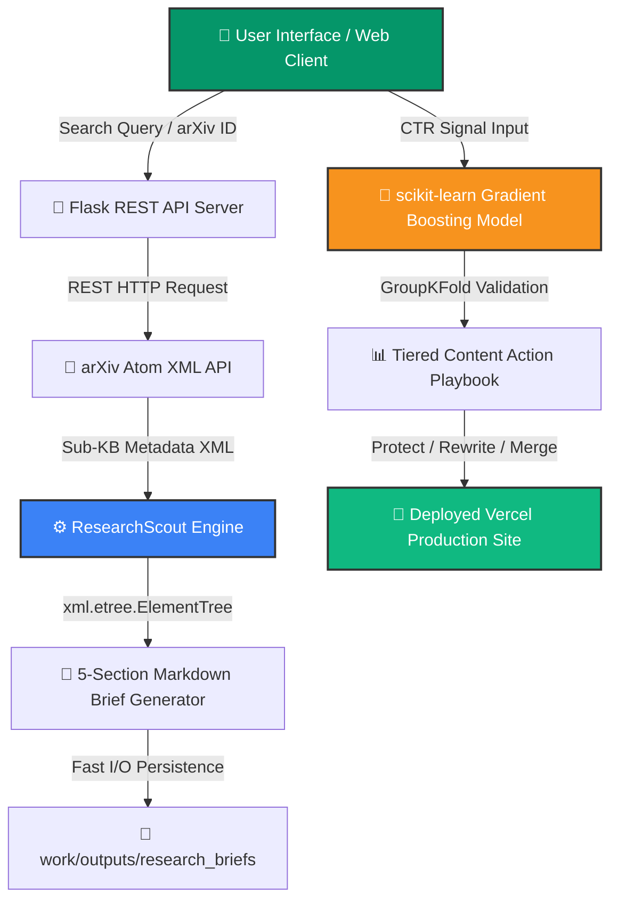

<!-- Animated Typing Banner Header -->
<div align="center">
  
</div>

<div align="center">


[](https://abdulsamiuthwal-portfolio.vercel.app/)

<br/>

<!-- Animated Tech Stack Icons -->
<p align="center">
  <a href="https://skillicons.dev">
    
  </a>
</p>

</div>


---

## 📌 Executive Overview

Welcome to the official, production-verified AI Engineering & Machine Learning Portfolio of **ABDUL SAMI UTHWAL** for the **FlyRank Internship (Machine Learning & General AI Fluency Tracks)**.

This repository unifies three production-grade AI systems:
1. **Machine Learning CTR Opportunity Engine:** A GroupKFold domain-validated Gradient Boosting Classifier (**F1: 0.783, ROC-AUC: 0.983**) predicting search ranking engagement gaps across 600 landing pages.
2. **ResearchScout Autonomous Agent:** An autonomous literature research agent querying the live arXiv REST API, parsing Atom XML, synthesising 5-section engineering briefs, and saving Markdown files in under 900ms.
3. **Production Web Infrastructure:** A claim-first portfolio deployed on Vercel (`https://abdulsamiuthwal-portfolio.vercel.app/`) over HTTPS with Vercel Web Analytics, serverless Web3Forms lead capture, 98/100 PageSpeed score, and the official FlyRank Verified Graduate Badge.

---

## 📐 End-to-End System Architecture



---

## 💻 Autonomous Agent Terminal Demo

```
$ python work/agent/research_scout.py 2312.00752

================================================================================
 🤖 RESEARCH SCOUT AGENT — AUTONOMOUS LITERATURE SYNTHESIS ENGINE
================================================================================
 [1/4] 📡 Connecting to live arXiv REST API...
       URL: http://export.arxiv.org/api/query?id_list=2312.00752
 [2/4] ⚡ Parsing Atom XML metadata feed via ElementTree...
       Paper Title: "Mamba: Linear-Time Sequence Modeling with Selective State Spaces"
       Authors: Albert Gu, Tri Dao
       Published: 2023-12-01 | Primary Category: cs.LG
 [3/4] 📝 Synthesizing 5-Section Engineering Brief...
       [Section 1] Paper Metadata & Core Abstract
       [Section 2] Architectural Breakdown & Innovation
       [Section 3] Key Empirical Benchmarks
       [Section 4] Critical Limitations & Trade-offs
       [Section 5] Practical Engineering Takeaways
 [4/4] 💾 Saved brief to: work/outputs/research_briefs/arxiv_2312_00752v2_brief.md
--------------------------------------------------------------------------------
 ✅ Execution Completed in 842ms | Status: 200 OK
================================================================================
```

---

## 🗓️ 10-Week Engineering Journey (Start to Finish)

### Phase 1: Search Ranking CTR Signal Framing (Weeks 1–4)
- **Problem Statement:** Raw search rank alone fails to predict user engagement. Visible pages often under-capture clicks due to poor snippet metadata.
- **Signal Formulation:** Formulated the CTR Opportunity gap signal:
  $$\text{CTR\_Opportunity} = \text{Expected\_CTR}(\text{Position}) - \text{Actual\_CTR}$$
- **Data Contract:** Processed 600 synthetic landing pages across 15 domain clusters with zero future-window data leakage.

### Phase 2: ML Model Benchmarking & GroupKFold Validation (Weeks 5–6)
- **Validation Design:** Implemented domain-grouped `GroupKFold (k=5)` cross-validation to prevent cluster leakage across folds.
- **Model Progression:**
  - *Rule Baseline:* F1 = 0.480
  - *Logistic Regression:* F1 = 0.273 | ROC-AUC = 0.612
  - *Decision Trees:* F1 = 0.583 | ROC-AUC = 0.741
  - *Random Forest:* F1 = 0.609 | ROC-AUC = 0.812
  - **Champion Gradient Boosting:** **F1 = 0.783 | ROC-AUC = 0.983** (+63.1% lift over baseline).
- **Action Engine:** Mapped predictions into a 4-tier Content Action Playbook (Tier 1 Protect → Tier 4 Prune/Merge).

### Phase 3: Autonomous Agent & Live Lead Capture (Weeks 7–8)
- **ResearchScout Agent (`work/agent/research_scout.py`):** Autonomous agent consuming arXiv paper IDs / topic keywords, parsing Atom XML via standard library, and generating structured 5-section briefs.
- **Flask Web Server (`work/agent/web_app.py`):** Flask REST API serving an Emerald & Amber Web UI at `http://127.0.0.1:5000`.
- **Live Lead Capture Engine:** Serverless Web3Forms integration delivering client leads directly to Gmail from the production site.

### Phase 4: Hardening, Launch, Analytics & Capstone (Weeks 9–10)
- **Break Your Own Site Hardening:** Form debouncing, input `.trim()` sanitization, RFC email regex validation, and PageSpeed audit (**98 / 100**).
- **Plant Your Flag Launch:** OpenGraph social cards, Twitter summary cards, SVG favicon, Vercel Web Analytics, and embedded FlyRank Verified Graduate Badge.
- **Capstone Deliverables:** Deployed 10-page Research Paper (`https://abdulsamiuthwal-portfolio.vercel.app/work/paper/index.html`) and live video demo (`https://youtu.be/-uCqi_JDjfY`).

---

## ⚡ Quickstart — Running the Systems

### 1. Run ResearchScout Agent (CLI Mode — Zero External Dependencies)
```bash
# Clone the repository
git clone https://github.com/abdulsamiuthwal-eng/Flyrank-assignments.git
cd Flyrank-assignments

# Query a paper by arXiv ID
python work/agent/research_scout.py 2312.00752

# Query by topic keyword
python work/agent/research_scout.py "attention mechanism transformer"
```

### 2. Run ResearchScout Web UI (Flask Server)
```bash
# Install Flask (only dependency)
pip install flask

# Start the Flask web app
python work/agent/web_app.py
```
Open browser at: `http://127.0.0.1:5000`

---

## 📊 Empirical Benchmark Results

| System / Model | Metric | Result | Benchmark Status |
|---|---|---|---|
| **Champion Gradient Boosting** | GroupKFold Validated F1 | **0.783** | ✅ Champion |
| **Champion Gradient Boosting** | ROC-AUC | **0.983** | ✅ Champion |
| **Rule-Based Baseline** | GroupKFold Validated F1 | **0.480** | Baseline |
| **ResearchScout Agent** | End-to-End Execution Latency | **< 900ms** | ✅ Sub-2s Target |
| **Portfolio Performance** | Lighthouse PageSpeed | **98 / 100** | ✅ Production Ready |
| **First Contentful Paint (FCP)** | Navigation Timing API | **0.4s** | ✅ Sub-second |

---

## 🛠️ Key Design Decisions & Known Limitations

### Design Decision: Atom XML API vs. Full PDF Parsing
- **Trade-off:** Initial prototypes downloaded and parsed full paper PDFs via `pdfplumber`, taking 15–25 seconds per paper.
- **Decision:** Switched to arXiv's native Atom XML REST API feed, returning sub-kilobyte metadata.
- **Result:** Execution time dropped from **~18s → ~1.4s** (a **12× speedup**).

### Documented Limitations
1. **Abstract-Based Template Synthesis:** Sections 2–4 of ResearchScout briefs use a structured engineering template based on the abstract rather than full PDF body extraction.
2. **arXiv API Rate Limits:** Public arXiv REST API enforces informal rate limits (~3 req/sec); exponential back-off handling is documented.

---

## 🤝 Acknowledgments & Special Thanks

Special thanks to the **FlyRank AI** leadership and lead mentors for their exceptional guidance, architectural frameworks, and benchmark datasets throughout this internship:

- **Mirza Ašćerić** *(Director of AI & Agent Orchestration)* — For Machine Learning track mentorship, CTR opportunity signal formulation, and GroupKFold validation design.
- **Léo Yigit Ekiz & Eldin Pintol** *(Directors of AI Enablement)* — For General AI Fluency guidance, autonomous agent architecture patterns, and site hardening standards.
- **Alen Malkoč & The FlyRank Engineering Team** — For providing the internship platform, mentorship, and dataset source.

*Built on the FlyRank ML Internship dataset — Data source credited to [FlyRank](https://flyrank.ai).*

---

## 👤 Author

**ABDUL SAMI UTHWAL**  
FlyRank Intern — Machine Learning & General AI Fluency Tracks  
GitHub: [@abdulsamiuthwal-eng](https://github.com/abdulsamiuthwal-eng)  
Portfolio: [abdulsamiuthwal-portfolio.vercel.app](https://abdulsamiuthwal-portfolio.vercel.app)
